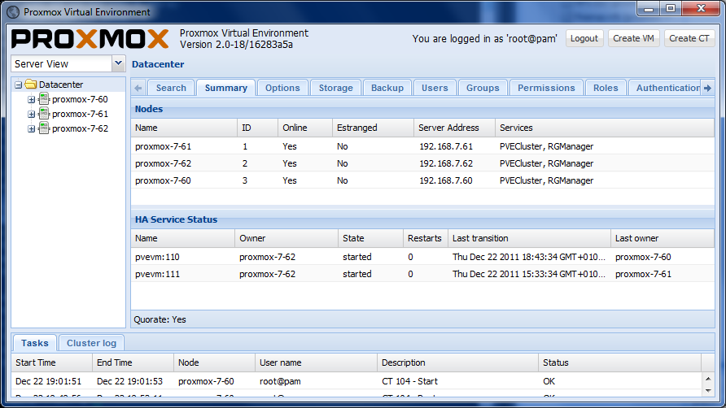

## Instalación y configuracion de un servidor de virtualización, Proxmox.

 

He decido montar un servidor virtual, en lugar de simplemente un servidor habitual, por las ventajas que ofrece la virtualización a día de hoy. No solo podemos instalar varios sistemas en la misma máquina (con el ahorro de espacio y energía que supone) si no que además podremos hacer imágenes para restaurar rápidamente en un momento crítico o para deshacer instalaciones internas, pruebas o errores de configuración, de una forma cómoda y sin tener que averiguar la solución.

### Tecnología

- HTML 5
- CSS 3
- jQuery
- Responsive Design
- PHP

### Cliente

Prácticas particulares.

### Descripción

Tras investigar y aprender bastante del tema, y haber hecho varias pruebas en la máquina virtual de mi ordenador y en la máquina virtual del servidor, me he decantado por la distribución Proxmox VE 3.1 (basado en Debian Wheezy) por sus simplicidad y optimización de recursos. En primer lugar decidí (y monte para probar) Ubuntu Server 12.04 con KVM y OpenVz de forma manual, pero me atrayó bastante el entorno web de administración de Proxmox y la comodidad de las consola virtuales ya enlazadas a vnc y todas las configuraciones necesarias. No he tenido muchas ganas de volver a tener que redirigir, comprobar y reiniciar muchas veces los servicios para que se medio automatice para cada máquina virtual que se vaya creando. Por ello, y siendo muy dificil de evitar la comodidad de algo ya hecho, probado y sobre todo apoyado por una comunidad activa (casi todos los errores se me resolvieron en la primera búsqueda en el buscador) termine instalando en el disco duro principal de mi servidor Proxmox. El material que he utilizado ha sido el siguiente:

- CPU AMD x64 3500+ (un solo core)
- Placa Base ASUS M2V
- 2 discos duros SATA
- Un teclado, monitor y ratón (que desaparecerán luego, por supuesto)

Requisitos necesarios:

- Imagen ISO de Promox VE 3.1
- PenDrive con más de 1Gb de capacidad
- Otro PC para acceder y comprobar la administración y los accesos
- Una imagen de Ubuntu Server y otro sistema operativo diferente
- Plugin del navegador de Java Jre/Jdk 7 o superior
- Unebootin u otro programa para instalar una ISO a USB

Bueno puesto que ya tenemos lo necesario vamos con el procedimiento de instalación, su configuración y puesta en marcha. Para comenzar nos tenemos que descargar previamente la imagen ISO de Proxmox VE 3.1. Una vez descargada, la pasaremos a un pendrive mediante unebootin. Cuando haya terminado de pasar la imagen al completo, salimos de unebootin y abrimos la ubicación del pendrive, para copiar la imagen ISO tal cual en la carpeta boot (aunque pienso que igualmente se podrá en cualquier otra, pero en esta nos aseguramos tener permisos luego) puesto que después tenemos que montarla en el punto de montaje /mnt en el arranque. Esto que acabo de relatar como una rutina sin aparene importancia me costo algún tiempo de investigación y pruebas con el arranque de la distribución, porque no esta prevista para iniciarse desde un pendrive y entonces nos da un error con la búsqueda del CDROM. Al iniciar el equipo desde el pendrive, elegimos el modo 'debug' y lo escribimos después de 'boot:' y esperamos a que intente iniciar el sistema, tras los errores de ruta del CDROM:

> _**no cdrom found!“ unable to continue (type exit or Ctrl-D to reboot)**_

nos aparecerá el SHELL, en que introduciremos lo siguiente: `fdisk -l` (para identificar la ruta al pendrive será /dev/sdb o algo similar) `mount /dev/sdb* /mnt` (siendo sdb\* el punto que esté en nuestro ordenador, cambiarlo) una vez tenemos el pendrive montado en /mnt, vamos a añadirle la ruta a la ISO que es desde donde queremos leer los ficheros necesarios. `mount -o loop -t iso9660 /mnt/proxmox_*.iso /mnt` (siendo proxmox\_\*.iso el nombre de vuestra iso) y por último, damos permisos de grupo y lanzamos el script de arranque del instalador. `chroot /mnt sbin/unconfigured.sh` (este último comando lo tendreis que escribir, no funciona el autocompletar, no os asusteis, lo lanza igualmente)

 

###### Fuentes: 
[http://upshell.wordpress.com/2011/11/25/install-proxmox-with-usb/](http://upshell.wordpress.com/2011/11/25/install-proxmox-with-usb/) 
[http://blog.desdelinux.net/proxmox-ve-una-interesante-herramienta-de-virtualizacion/](http://blog.desdelinux.net/proxmox-ve-una-interesante-herramienta-de-virtualizacion/)
