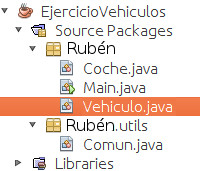

Ejercicio que muestra las habilidades adquiridas en la POO y aplica sus directrices.

Jerarquí­a de clases utilizada



##### _Dependencias_: clase "[utils](java-clase-para-entrada-por-teclado-control-del-buffer/ "Ir a la clase "Utils"")" propia.

 

```java
\*
\* EJERCICIO JAVA(Módulo 5) 
\* ------------------------------ 
\* VEHICULOS - (Main) 
\* 

package ruben;

import ruben.utils.*;

public class Main
{

    public static void main(String\[\] args)
    {

        int opcion;
        String marca;
        String modelo;
        int potencia;

        // Se introduce la marca, el modelo y la potencia al iniciar el programa
        // para pasarselo al constructor de vehiculo marca = "Seat"; modelo =
        // "Ibiza"; potencia = 120; Coche coche = new Coche(marca, modelo,
        // potencia);

        do {
            opcion = mostrarMenu();
            ejecutarAccion(coche, opcion);
        } while (opcion != 4);
    }

    public static int mostrarMenu()
    {
        int opcion;

        System.out.println("\\n### Menu ###\\n");
        System.out.println("1) Ver ficha");
        System.out.println("2) Comprar");
        System.out.println("3) Proxima revision");
        System.out.println("4) Salir\\n");

        opcion = Comun.leerEntero("Seleccione una opcion: ");

        return opcion;
    }

    private static void ejecutarAccion(Coche coche, int opc)
    {
        String nombre;
        int revision;

        try {
        switch (opc) {
            case 1: // Mostrar ficha del empleado coche.verFicha(); break;

            case 2: // Modificar los datos del empleado nombre =
                    // Comun.leerCadena("Introduzca el nombre del nuevo propietario:
                    // "); coche.comprar(nombre); break;

            case 3:
            revision =
                Comun.leerEntero("Introduzca el anio de la proxima revision: ");
            coche.revisar(revision);
            break;

            default:
            System.out.println("Opción no válida.");
            break;
        }
        } catch (Exception e) {
        System.out.println(e.toString());
        }
    }
}

```

```java
\* 
\* Clase VEHICULO \*/ package anfora;
\*
\* 
\* 
\* @author ruben 
*/ 

public class Vehiculo {

private String marca; private String modelo; public int anioRevision;

// Constructor Vehiculo(String marca, String modelo) { this.marca = marca; this.modelo = modelo; anioRevision = -1;

}

// Muestra la ficha del vehículo, marca, modelo y año public void verFicha() { System.out.println("\\n\\n------ Ficha del Vehiculo ------\\n"); System.out.println(" Marca: " + marca); System.out.println(" Modelo: " + modelo);

if (anioRevision == -1) // Comprobamos que el año no sea -1 { System.out.println(" Anio revision: " + "pendiente de informar"); } else { System.out.println(" Anio revision: " + anioRevision); }

}

// Recibe como parámetro el año de la próxima revisión de ITV public void revisar(int anioRevision) { this.anioRevision = anioRevision;

System.out.println("\\nAnio que le corresponde la revision: " + anioRevision); }

}
```

```java

/\* \* Clase COCHE que hereda de la clase VEHICULO \*/ package ruben;

/\*\* \* \* @author ruben \*/ public class Coche extends Vehiculo {

private String propietario; private int potencia;

// Constructor Coche(String marca, String modelo, int potencia) { //Llama al constructo de la clase base. super(marca, modelo); propietario = ""; this.potencia = potencia;

}

// Muestra la ficha de la clase base, propietario y potencia @Override public void verFicha() { super.verFicha();

if (propietario == "") { System.out.println(" Propietario: " + "No indicado"); } else { System.out.println(" Propietario: " + propietario); }

System.out.println(" Potencia: " + potencia + " CV"); System.out.println("\\n----------------------------------\\n");

}

// Recibe el nombre del propietario public void comprar(String nombre) { this.propietario = nombre; }

// Sobreescribe el método de la clase base. // Los coches que ya han tenido alguna revisión, deben tener la próxima antes de dos años. @Override public void revisar(int anioRevision) { super.revisar(anioRevision);

if (anioRevision > -1) { anioRevision += 2; }

}

}
```
