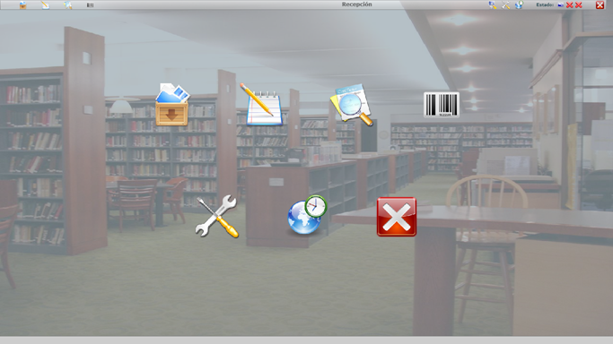

## Biblioteca Flex/AIR

 

He creado una aplicación para la gestión de libros de una biblioteca, la principal particularidad es que no requiere saber todos los datos del libro, mediante el ISBN, autor, nombre u otro… se comunica a Amazon y provee el resto de datos.

Esta aplicación la realicé hace bastante tiempo, por lo que el código es prácticamente ilegible e indudablemente no cumple ninguna de las "buena prácticas" en programación, pero quizas sea interesante alguna de las operaciones que realiza. Deseo que se utilice lo que necesite, y solamente me gustaría que me lo comuncasen he indiquen mi autoría junto con la de los fragmentos que recopilé e incorporé en algunos casos.

Las funcionalidades más destacables son:

- Alta de libros, de forma automática o manual.
- Edición y modificación de libros.
- Consulta y listados de libros, según criterios y datos de consulta.
- Generación de código de barras, en caso de ser edición antigua.
- Gestión de las opciones de la aplicación (pendiente).
- Gestión y consulta de actualizaciones.
- Modo ventana / pantalla completa.

Estos son algunos ejemplos de la aplicación:

\[gallery ids="705,706,707,708"\]

### Content License

Creative Commons 

This web page, all content with proyects and source code, is licensed under Creative Commons: Attribution-NonCommercial-NoDerivatives 4.0 International (CC BY-NC-ND 4.0) [More info](https://creativecommons.org/licenses/by-nc-nd/4.0/)

Esta página web y todo su contenido, incluido proyectos y código fuente, está licenciado bajo una licencia de Creative Commons: Attribution-NonCommercial-NoDerivatives 4.0 International (CC BY-NC-ND 4.0) [Más info](https://creativecommons.org/licenses/by-nc-nd/4.0/deed.es)
