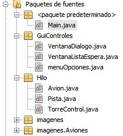

He realizado otra práctica para demostrar el funcionamiento de los hilos y su sincronización en JAVA mediante Applets.

 

- Al final se encuentra una captura con el funcionamiento del programa.
- Documentación con la explicación del proyecto y los casos contemplados
- El código fuente separado en clases, junto con la estructura utiliza.
- Un enlace de descarga del fichero JAR y el código fuente.

 **Documentación y casos contemplados**



**Captura de pantalla del programa en ejecución**

<video width="100%" muted controls>
    <source src="aeropuerto.mp4" type="video/mp4">
</video>

**Código fuente**

Jerarquí­a de clases

[![Code-Optimization-3-256x256[1]](Code-Optimization-3-256x2561.png)](https://bitbucket.org/rubenarcos/java-hilos-aeropuerto)

##### Documentación adicional funcionamiento aeroportuario:
- [Control del tráfico aéreo](../assets/pdfs/Control-del-tráfico-aéreo.pdf)  
- [Matrí­culas aeronaves](../assets/pdfs/Matrículas-aeronaves.pdf)
    

### Content License

Creative Commons 

This web page, all content with proyects and source code, is licensed under Creative Commons: Attribution-NonCommercial-NoDerivatives 4.0 International (CC BY-NC-ND 4.0) [More info](https://creativecommons.org/licenses/by-nc-nd/4.0/)

Esta página web y todo su contenido, incluido proyectos y código fuente, está licenciado bajo una licencia de Creative Commons: Attribution-NonCommercial-NoDerivatives 4.0 International (CC BY-NC-ND 4.0) [Más info](https://creativecommons.org/licenses/by-nc-nd/4.0/deed.es)
