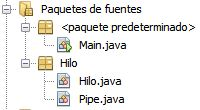

A continuación se muestra una serie de 8 ejercicios que voya a ir mostrando tanto en consola como de forma gráfica mediante el uso de applets. Cabe de estacar que los he subido en orden incremental de dificultad, puesto que considero que así­ facilitará su compresión y futura aplicación.

Considero que el código es suficientemente explicativo como para no tener que documentarlo de forma explí­cita, no obstante si tienes alguna duda déjame un comentario y te lo explico lo antes posible.

El ejercicio está representado mediante lo cola de espera de un supermercado. Habiendo una caja por la cual se realizará el cobro de los productos y un número aleatorio de clientes por cada ejecución de la aplicación como de productos. La sincronización de los hilos se realiza en la caja (Pipe), la cual solo podrá cobrar un cliente y el resto se encontrarán a la espera. Recordar que tanto los clientes como los productos que lleva cada uno en su cesta se generará de forma aleatoria al comienzo de la aplicación. Se ha asignado un tiempo de espera de 1 segundo por el cobro de cada producto unitario.

 



**Clase principal** _(Main.java)_ Es la que se ejecutará en primera instancia, y contendrá un array de clientes y realizará tanto la creación de la caja (Pipe) como de los clientes (Threads).

```java
import Hilo.Hilo; 
import Hilo.Pipe; 
import java.util.ArrayList;

public class Main {

private static int numClientes = 10; private static int numProductos = 5; private static ArrayList&amp;amp;lt;Hilo&amp;amp;gt; listaClientes; private static Pipe caja;

public static void main(String\[\] args) { caja = new Pipe(numClientes); listaClientes = new ArrayList&amp;amp;lt;&amp;amp;gt;(); iniciarCaja(); iniciarCobroCliente(); }

private static void iniciarCaja() { for (int i = 0; i &amp;amp;lt; caja.generarAleatorio(1, numClientes); i++) { System.out.println("El cliente " + (i) + " se ha puesto en cola."); listaClientes.add(new Hilo(i, numProductos, caja)); } }

private static void iniciarCobroCliente() { for (int i = 0; i &amp;amp;lt; listaClientes.size(); i++) { listaClientes.get(i).start(); } System.out.println("\\nPasen por caja por favor..."); System.out.println("---------------------------"); }

}
```

**Clase Cliente** _(Hilo.java)_ Esta clase es la que se va a ir ejectando por cada hilo, es el hilo propiamente. Por ello el constructor, nos devolverás sus propiedades, tales como el nombre o el Pipe en el que se encuentra en el momento.

```java
package Hilo;

import java.util.Arrays;

public class Hilo extends Thread {

private Pipe caja; private int nombre, ultimoCobrado; private int\[\] productos;

public Hilo(int nombre, int numProductos, Pipe caja) { this.nombre = nombre; this.caja = caja; ultimoCobrado = -1; this.setName(String.valueOf(nombre)); productos = new int\[caja.generarAleatorio(1, numProductos)\]; for (int i = 0; i &amp;amp;lt; productos.length; i++) { productos\[i\] = caja.generarAleatorio(1, 10); } System.out.println("El cliente " + (nombre) + " lleva en la cesta " + Arrays.toString(productos)); }

@Override public void run() { try { while (ultimoCobrado &amp;amp;lt; productos.length) { ultimoCobrado = caja.cobrar(nombre, productos); } } catch (InterruptedException ex) { System.out.println("ERROR: hilo bloqueado. " + ex); } }

}

```

**Clase caja registradora** _(Pipe.java)_

Es aquí­ donde se gestiona realmente la sincronización de los hilos. Se realiza el control de que solamente se atienda un hilo (el que primero lo solicite) y que se vayan realizando los cobros de los productos, 'durmiendo' la ejecución de este hilo durante 1 seg, el resto de hilos, conforme van solicitando el acceso y se les deniega, se les cambia el estado a 'dormido' para optimizar el rendimiento y evitar ciclos inecesarios de procesos independientes que requiere de un recurso que se encuentra ocupado, en este caso nuestra caja registradora.

Cuando finaliza la ejecución del hilo, se genera una excepción de interrupción para indicar que se pueden reactivar los hilos que se encontraban a la espera 'dormidos'.

```java
package Hilo;

public class Pipe {

private int numClientes, ultimoCliente, cantProdCob; private int\[\]clientes;

public Pipe(int numClientes) { this.numClientes = numClientes; clientes = new int\[numClientes\]; for (int i = 0; i &amp;amp;lt; clientes.length; i++) { clientes\[i\] = 0; } ultimoCliente = 0; cantProdCob = 0; System.out.println("Se ha abierto la caja"); System.out.println("---------------------"); }

public synchronized int cobrar(int nombreHilo, int\[\] productos) throws InterruptedException { if (nombreHilo == ultimoCliente) { for (int i = 0; i &amp;amp;lt; productos.length; i++) { System.out.println("Cobrando...("+productos\[i\]+" seg.)"); clientes\[nombreHilo\]++; Thread.sleep(productos\[i\] \* 1000); System.out.println("Se ha combrado: cliente " + nombreHilo + ", producto " + i); } System.out.println("\\t\\t\\t\\t\\t\*\*\* El cliente " + nombreHilo + " ha pasado todos sus productos."); ultimoCliente=nombreHilo+1; notifyAll(); }else{ wait(); } return clientes\[nombreHilo\]; }

public int generarAleatorio(int min, int max) { return min + (int) (Math.random() \* max); }

}
```

### Content License

Creative Commons [](https://creativecommons.org/licenses/by-nc-nd/4.0/)

This web page, all content with proyects and source code, is licensed under Creative Commons: Attribution-NonCommercial-NoDerivatives 4.0 International (CC BY-NC-ND 4.0) [More info](https://creativecommons.org/licenses/by-nc-nd/4.0/)

Esta página web y todo su contenido, incluido proyectos y código fuente, está licenciado bajo una licencia de Creative Commons: Attribution-NonCommercial-NoDerivatives 4.0 International (CC BY-NC-ND 4.0) [Más info](https://creativecommons.org/licenses/by-nc-nd/4.0/deed.es)
