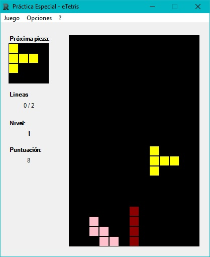

Juego del Tetris realizado en C# para plataforma Windows con creación de piezas propias

 **Ejemplo de ejecución**

 **Documentación y casos contemplados**



 **Ejecutable y código fuente**

[Ver código fuente](https://bitbucket.org/rubenarcos/tetris-c/src)

[Descargar ejecutable](https://bitbucket.org/rubenarcos/tetris-c/downloads/Tetris.zip)

### Content License

Creative Commons 

This web page, all content with proyects and source code, is licensed under Creative Commons: Attribution-NonCommercial-NoDerivatives 4.0 International (CC BY-NC-ND 4.0) [More info](https://creativecommons.org/licenses/by-nc-nd/4.0/)

Esta página web y todo su contenido, incluido proyectos y código fuente, está licenciado bajo una licencia de Creative Commons: Attribution-NonCommercial-NoDerivatives 4.0 International (CC BY-NC-ND 4.0) [Más info](https://creativecommons.org/licenses/by-nc-nd/4.0/deed.es)
