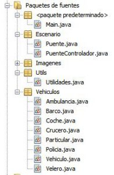

He realizado una práctica para demostrar el funcionamiento de los hilos y su sincronización en JAVA mediante Applets.

- Al final se encuentra una captura con el funcionamiento del programa.
- Documentación con la explicación del proyecto y los casos contemplados
- El código fuente separado en clases, junto con la estructura utiliza.
- Un enlace de descarga del fichero JAR y el código fuente.

** Documentación y casos contemplados**

\[pdfjs-viewer url="https%3A%2F%2Fwww.rarcos.com%2Fwp-content%2Fuploads%2F2017%2F06%2FExamen-1%C2%BA-evaluaci%C3%B3n.pdf" viewer\_width=100% viewer\_height=1360px fullscreen=false download=false print=false\]

**Captura de pantalla del programa en ejecución**

\[video src="http://localhost/wp-content/uploads/2017/01/053016\_1753\_HilosenJAVA1.mp4" loop="true" autoplay="true" preload="auto"\]\[/video\]

**Código fuente**

Jerarquía de clases

Código fuente

[![Code-Optimization-3-256x256[1]](images/Code-Optimization-3-256x2561-150x150.png)](https://bitbucket.org/rubenarcos/java-hilos-puente-levadizo/src/371434a0845336ac25a8ccd53ae010caeb6c183d/src/?at=master)

### Content License

Creative Commons 

This web page, all content with proyects and source code, is licensed under Creative Commons: Attribution-NonCommercial-NoDerivatives 4.0 International (CC BY-NC-ND 4.0) [More info](https://creativecommons.org/licenses/by-nc-nd/4.0/)

Esta página web y todo su contenido, incluido proyectos y código fuente, está licenciado bajo una licencia de Creative Commons: Attribution-NonCommercial-NoDerivatives 4.0 International (CC BY-NC-ND 4.0) [Más info](https://creativecommons.org/licenses/by-nc-nd/4.0/deed.es)
