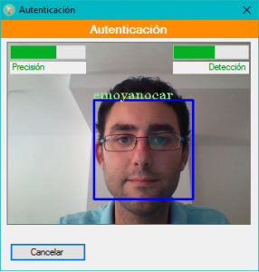
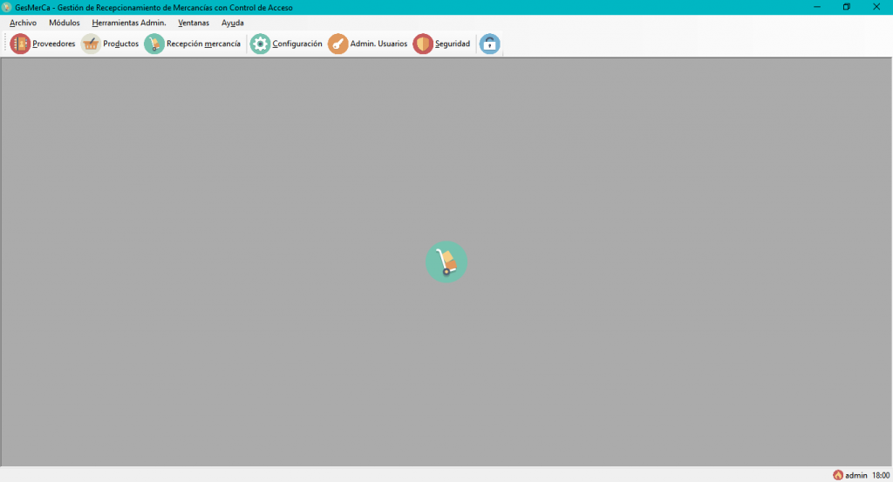

Proyecto integrado fin del Ciclo Formativo de Grado Superior de Aplicaciones Multiplataformas

 

 **Presentación y exposición del proyecto**

\[video src="http://localhost/wp-content/uploads/2017/07/GesMerCa\_defensa.mp4" autoplay="true" preload="auto"\]\[/video\]

\[pdfjs-viewer url="https%3A%2F%2Fwww.rarcos.com%2Fwp-content%2Fuploads%2F2017%2F07%2FGesMerCa\_defensa\_anticopia.pdf" viewer\_width=100% viewer\_height=1360px fullscreen=false download=false print=false\]

 **Ejemplo de ejecución**

 

 

**¿Porqué se eligen estos mecanísmos de autenticación?**

<iframe src="https://www.youtube.com/embed/MFHeKRsQtGE" width="560" height="440" frameborder="0" allowfullscreen="allowfullscreen"></iframe>

 

 **Documentación completa y diagramas del proyecto**

\[pdfjs-viewer url="https%3A%2F%2Fwww.rarcos.com%2Fwp-content%2Fuploads%2F2017%2F07%2FDocumentacion\_GESMERCA\_anticopia.pdf" viewer\_width=100% viewer\_height=1360px fullscreen=false download=false print=false\]

 

 **Ejecutable y código fuente**

1) Realizar la instalación. 2) Ejecución de GesMerca 2.1) Los credenciales por defecto son:

\- Administrador:

Uss: admin

Pass: admin

\- Usuario:

Uss: ruben

Pass: 123456

\- Código de bloqueo del terminal: 5555

3) En la ventana de configuración, una vez iniciada la sesión como administrador, se puede cambiar la forma de realizar el login inicial, también la configuración personalizada para un usuario concreto, en la misma ventana. Los privilegios se detectarán de forma automática.

4) La conexión a la base de datos está configurada a una copia de pruebas en la nube por defecto. No obstante, es posible cambiar la configuración en un fichero local.

[Descargar instalador .msi](https://bitbucket.org/rubenarcos/gesmerca-c/downloads/GesMerCa.msi)

[Descargar instalado .exe](https://bitbucket.org/rubenarcos/gesmerca-c/downloads/setup.exe)

 

### Content License

Creative Commons 

This web page, all content with proyects and source code, is licensed under Creative Commons: Attribution-NonCommercial-NoDerivatives 4.0 International (CC BY-NC-ND 4.0) [More info](https://creativecommons.org/licenses/by-nc-nd/4.0/)

Esta página web y todo su contenido, incluido proyectos y código fuente, está licenciado bajo una licencia de Creative Commons: Attribution-NonCommercial-NoDerivatives 4.0 International (CC BY-NC-ND 4.0) [Más info](https://creativecommons.org/licenses/by-nc-nd/4.0/deed.es)
