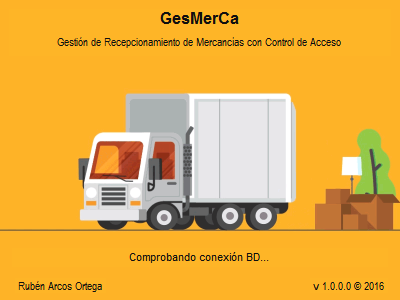
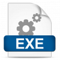

Proyecto integrado fin del Ciclo Formativo de Grado Superior de Aplicaciones Multiplataformas

**Presentación y exposición del proyecto**
<video width="100%" muted controls>
    <source src="GesMerCa_defensa.mp4" type="video/mp4">
</video>



**Ejemplo de ejecución**

**¿Porqué se eligen estos mecaní­smos de autenticación?**

<iframe src="https://www.youtube.com/embed/MFHeKRsQtGE" width="560" height="440" frameborder="0" allowfullscreen="allowfullscreen"></iframe>

**Documentación completa y diagramas del proyecto**



**Ejecutable y código fuente**

1) Realizar la instalación. 2) Ejecución de GesMerca 2.1) Los credenciales por defecto son:
- Administrador:
    Uss: admin
    Pass: admin
- Usuario:
    Uss: ruben
    Pass: 123456
- Código de bloqueo del terminal: 5555

3) En la ventana de configuración, una vez iniciada la sesión como administrador, se puede cambiar la forma de realizar el login inicial, tambií©n la configuración personalizada para un usuario concreto, en la misma ventana. Los privilegios se detectarí¡n de forma automática.
4) La conexión a la base de datos estí¡ configurada a una copia de pruebas en la nube por defecto. No obstante, es posible cambiar la configuración en un fichero local.

[Descargar instalador .msi](https://bitbucket.org/rubenarcos/gesmerca-c/downloads/GesMerCa.msi)

[Descargar instalado .exe](https://bitbucket.org/rubenarcos/gesmerca-c/downloads/setup.exe)

### Content License

Creative Commons 

This web page, all content with proyects and source code, is licensed under Creative Commons: Attribution-NonCommercial-NoDerivatives 4.0 International (CC BY-NC-ND 4.0) [More info](https://creativecommons.org/licenses/by-nc-nd/4.0/)

Esta página web y todo su contenido, incluido proyectos y código fuente, está licenciado bajo una licencia de Creative Commons: Attribution-NonCommercial-NoDerivatives 4.0 International (CC BY-NC-ND 4.0) [Más info](https://creativecommons.org/licenses/by-nc-nd/4.0/deed.es)
