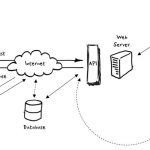
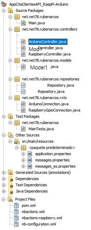

He realizado el siguiente proyecto de pruebas RESTful para la comunicación mediante una interfaz cliente en Arduino y Raspberry pi y con un servidor basado en Spring para la gestión de la API. En ambos clientes se dispone de acceso a los elementos físicos de hardware mediante comunicación I/O a las GPIOs correspondientes.

 

La idea de realización consiste en la gestión de un contador basado e instalado en una placa Arduino Uno que consta de un botón y un display LED para la visualización del mismo, a su vez el programa de este gestiona la posibilidad de incremento físico del contador (mediante el botón), como mediante la recepción exterior por el puerto COM (USB) y la asignación de un valor expecífico recibido en remoto.

Por otra parte la placa Raspberry Pi, alberga el servidor de gestió de la API, la comunicación con Arduino Uno (mediante USB, aunque podría haberse instalado online: bluetooth, wifi local/nube) y a la GPIO.

 

El consumo de la API se podrá realizar a través de cualquier cliente HTTP, bien sea web o App Android, por ejemplo (estando en construcción esta última, que mostraré aquí en breve, cuando esté libre de errores).

 

\[caption id="attachment\_1428" align="alignright" width="150"\] Esquema con el diseño proyectado del sistema\[/caption\]

#### **Composición y diseño:**

- Hardware   : Arduino

 Display LED numérico y Botón con comunicación I/O sobre COM port

 C-Arduino comunnication I/O COM port, Display LED output, Botón input, Contador

- Middleware & Server : Raspberry Pi

 Tomcat con Spring WebAPI services

        Raspberry Py I/O GPIO controller, LED pin out

- Client : Cualquier conexión HTTP

HTTP API consume: Web & App Android

 

#### **Elementos de Hardware** que componen el sistema:

 

\[gallery columns="4" ids="1410,1415,1412,1413"\]

 

### La creación del servidor

El servidor se ha creado mediante el framework de Spring incluyendo:

- Comunicación DB mediante JPA e Hibernate
- SSH para depuración y deploy remoto en Raspberry Pi
- Gestión HTTP para los controller de la API
- Comunicación y gestión de puertos GPIO (elementos físicos de hardware)
    - Arduino con conexión COM (USB) a Raspberry Pi
    - GPIO I/O Raspberry Pi
- Generador aleatorio de nombres (crea los datos de la DB con formatos 'previsibles'

 

> _Destacar que está pendiente de implementar lo incorporación de seguridad (Spring Security) y encriptación de las comunicaciones mediante HTTPS y DB de datos sensibles_

En el servidor se encuentra toda gestión de la comunicación con la DB, también están los DTO (modelos de datos que se publican en la api para su futuro consumo desde un app Android), los controladores: datos de la DB (DTOs), Contador Android, LED en Raspberry pi y sus correspodientes driver para acceso a GPIO y comunicación puerto COM.

 

La compilación, depuración y deploy se está realizando en remoto desde un PC que se encuentra en la misma (o no) red que la Raspberry Pi, a la que se ataca mediante SSH para su control y subida de ficheros. La configuración de esta conexión se encuentra declarada el pom.xml, pero está prevista la externalización a un fichero externo encriptado (está retrasado por la dependencia de una librería de terceros).

 

A continuación se muestra el transcurso de un funcionamiento esperado para sistema:

1. Deploy remoto en raspberry
2. Encendido y comunicación Raspberry<->Arduino
3. Puesta en marcha e incremento contador
4. Consumo API y modificación contador desde esta

 

Incremento del contador de forma manual (mediante botón físico) y comunición Arduino > Raspberry Pi 
mediante puerto COM y consumo API obtención contador

\[video src="http://localhost/wp-content/uploads/2018/10/arduino\_on\_manual.mp4" autoplay="false" preload="auto"\]\[/video\]

Comunicación Raspberry Pi GPIO desde servidor mediante consumo API, control y obtención estado LED

\[video src="http://localhost/wp-content/uploads/2018/10/raspberry\_led.mp4" autoplay="false" preload="auto"\]\[/video\]

Comunicación Raspberry Pi > Arduino desde servidor mediante consumo API, control contador

\[video src="http://localhost/wp-content/uploads/2018/10/arduino\_ctrl\_api.mp4" autoplay="false" preload="auto"\]\[/video\]

 

### Content License

Creative Commons 

This web page, all content with proyects and source code, is licensed under Creative Commons: Attribution-NonCommercial-NoDerivatives 4.0 International (CC BY-NC-ND 4.0) [More info](https://creativecommons.org/licenses/by-nc-nd/4.0/)

Esta página web y todo su contenido, incluido proyectos y código fuente, está licenciado bajo una licencia de Creative Commons: Attribution-NonCommercial-NoDerivatives 4.0 International (CC BY-NC-ND 4.0) [Más info](https://creativecommons.org/licenses/by-nc-nd/4.0/deed.es)
