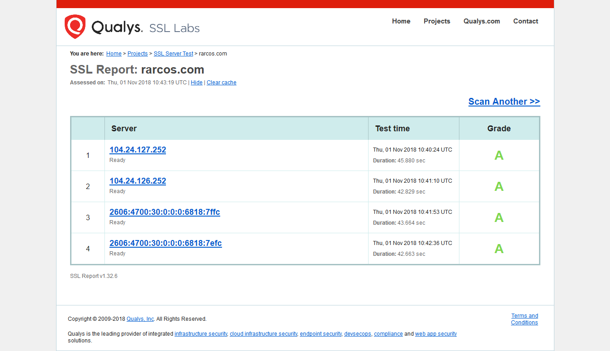
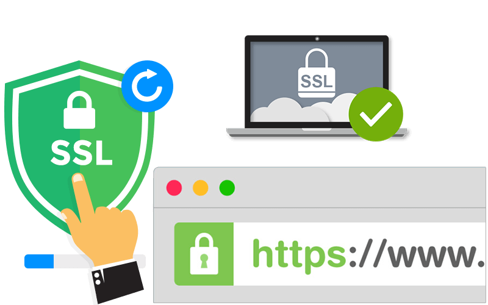

He actualizado recientemente esta web para que satisfaga las nuevas exigencias de navegación segura, concretamente con un certificado de seguridad, para que la comunicación se realice de forma segura mediante el protocolo HTTPS.

Como podeis comprobar en la imagen, tras el [escaneo de toda la traza de ruta](https://www.ssllabs.com/ssltest/analyze.html?d=rarcos.com) de redirecciones desde el dominio (DNS) hasta el alojamiento web (hosting) se realiza de forma segurida y encriptada, por tanto.

Espero que disfruteis de todos los contenidos e información de mi web como hasta ahora, pero con la tranquilidad de todas las ventajas que ofrece la navegación segura.

 

Puedes comprobarlo en tu barra de búsqueda:

